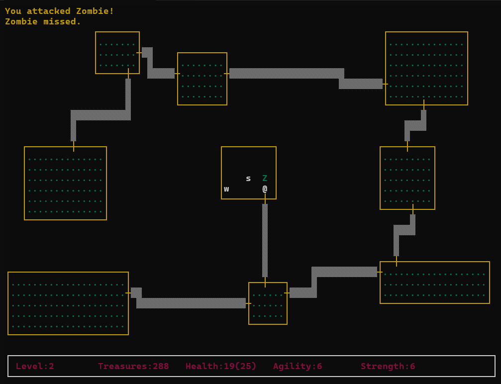
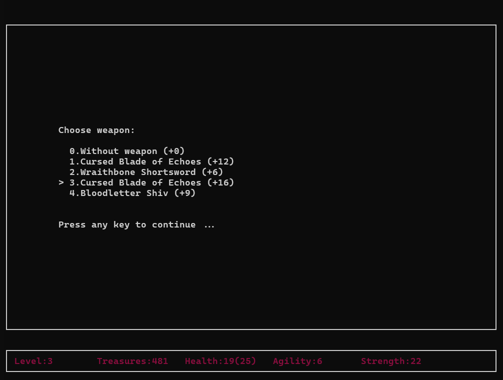
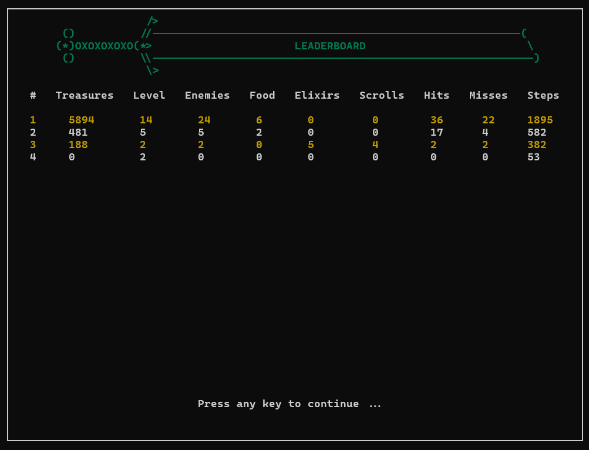

# RogueGame
Console roguelike game implemented using Golang and goncurses.

## Description

The game is implemented in the style of the classic 1980 game Rogue. It contains 21 level. Each level is dungeon which contains 9 rooms with monsters and items, connected with corridors.  
Player has characteristics: health, max health, strength and agility, they can be changed with scrolls, elixirs, food and weapons.  

App has layers:  

* Presentation (View, UI);
* Domain (Business Logic);
* Data Source.

## Features

* Monsters: Zombie, Vampire, Snake-Wizard, Ogre;
* Saving and loadig game and statistics from JSON;

## Controls

- Moving and fighting - W, A, S, D;
- Items from inventory:
  - Choose weapon - H;
  - Choose food - J;
  - Choose elixir - K;
  - Choose scroll - E;
- Exit - Q.

## Dependencies

* Golang >= 1.22.0
* Makefile
* goncurses

## Building project

`make` or `make run`

## Authors

[aasorokina](https://github.com/aasorokina)  
[tdutanton](https://github.com/tdutanton)  
[ent1k1377](https://github.com/ent1k1377)